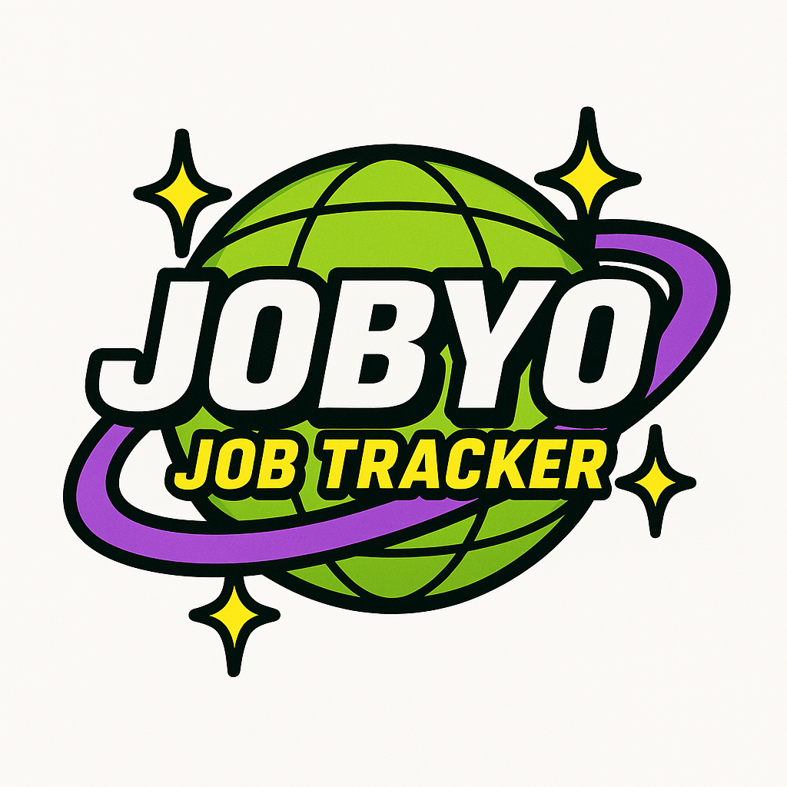

# Job Application Tracker

<p align="center">
  
</p>

Jobby is a modern web application built with Next.js and Prisma that helps job seekers track and visualize their job application progress. The application features a clean UI, intuitive job entry form, and interactive Sankey chart visualization to track the flow of applications through different stages.

## Table of Contents

- [Features](#features)
- [Tech Stack](#tech-stack)
- [Architecture](#architecture)
- [Project Structure](#project-structure)
- [Key Files and Components](#key-files-and-components)
- [Getting Started](#getting-started)
- [Database Schema](#database-schema)
- [Application Flow](#application-flow)

## Features

- **Job Application Tracking**: Create, view, and manage job applications
- **Status Tracking**: Track applications across multiple stages (Applied, Online Test, Interviews, etc.)
- **Data Visualization**: Interactive Sankey chart visualizing job application flow through stages
- **Responsive Design**: Works on desktop and mobile browsers
- **Local Database**: SQLite database for data persistence

## Tech Stack

- **Frontend**:
  - Next.js 15+ (React framework)
  - TypeScript for type safety
  - Tailwind CSS for styling
  - React Google Charts for data visualization

- **Backend**:
  - Next.js API routes
  - Prisma ORM for database access
  - SQLite database (can be configured for other databases)

- **Development Tools**:
  - TypeScript for type checking
  - ESLint for code linting
  - Zod for schema validation

## Architecture

Jobby follows a modern web application architecture:

```
┌─────────────────┐      ┌─────────────────┐      ┌─────────────────┐
│                 │      │                 │      │                 │
│  React UI       │──────│  Next.js API    │──────│  Prisma ORM     │
│  Components     │      │  Routes         │      │  + SQLite DB    │
│                 │      │                 │      │                 │
└─────────────────┘      └─────────────────┘      └─────────────────┘
```

- **UI Layer**: React components for user interaction
- **API Layer**: Next.js API routes for data processing
- **Data Layer**: Prisma ORM connecting to SQLite database

## Project Structure

```
jobby/
├── src/                    # Source code
│   ├── app/                # Next.js app router pages
│   │   ├── api/            # API routes
│   │   ├── globals.css     # Global styles
│   │   ├── layout.tsx      # Root layout component
│   │   └── page.tsx        # Main page component
│   ├── components/         # React components
│   │   ├── ui/             # UI components
│   │   ├── JobForm.tsx     # Job application form
│   │   └── JobSankeyChart.tsx # Sankey chart visualization
│   └── lib/                # Utility functions and shared code
│       ├── sampleData.ts   # Sample data for testing
│       ├── types.ts        # TypeScript types
│       └── utils.ts        # Utility functions
├── prisma/                 # Prisma ORM
│   └── schema.prisma       # Database schema
├── scripts/                # Utility scripts
│   └── seed.ts             # Database seeding script
├── public/                 # Static assets
└── ...                     # Configuration files
```

## Key Files and Components

### Frontend

#### `src/app/page.tsx`
The main page component that includes the job form and visualization. It manages the state of job applications and handles form submission.

#### `src/components/JobForm.tsx`
A form component for creating new job applications with validation using Zod.

#### `src/components/JobSankeyChart.tsx`
A visualization component using Google Charts to display a Sankey diagram of job application flow through different stages.

### Backend

#### `src/app/api/`
Contains API routes for CRUD operations on job applications.

#### `prisma/schema.prisma`
Defines the database schema for job applications.

#### `scripts/seed.ts`
Seeds the database with sample job applications for testing or demonstration.

### Shared

#### `src/lib/types.ts`
Contains TypeScript types and Zod schemas for job applications.

## Getting Started

1. **Clone the repository**
   ```bash
   git clone https://github.com/yourusername/jobby.git
   cd jobby
   ```

2. **Install dependencies**
   ```bash
   npm install
   ```

3. **Set up the database**
   ```bash
   npx prisma generate
   npm run seed
   ```

4. **Start the development server**
   ```bash
   npm run dev
   ```

5. **Open your browser**
   Open [http://localhost:3000](http://localhost:3000) to view the application.

## Database Schema

The application uses a simple SQLite database with a single `JobApplication` model:

```prisma
model JobApplication {
  id              String    @id @default(cuid())
  companyName     String
  position        String
  jobUrl          String?
  dateApplied     DateTime  @default(now())
  status          String    @default("APPLIED") 
  notes           String?
  createdAt       DateTime  @default(now())
  updatedAt       DateTime  @updatedAt
}
```

Job statuses include: APPLIED, ONLINE_TEST, RECORDED_INTERVIEW, FIRST_INTERVIEW, SECOND_INTERVIEW, ASSESSMENT_CENTER, REJECTED, WITHDRAWN.

## Application Flow

The Sankey chart visualizes the flow of job applications through different stages:

```
Jobs Applied → Online Test → Recorded Interview → First Interview → Second Interview → Assessment Center
    │              │                 │                  │                  │                 │
    ↓              ↓                 ↓                  ↓                  ↓                 ↓
  No Reply        Rejected        Withdrawn         Rejected           Rejected          Rejected
```

This visualization helps job seekers understand their application funnel and identify where they are most successful or where they might need to focus improvement efforts.

---

## Contributing

Contributions are welcome! Please feel free to submit a Pull Request.

## License

This project is licensed under the MIT License - see the LICENSE file for details.
